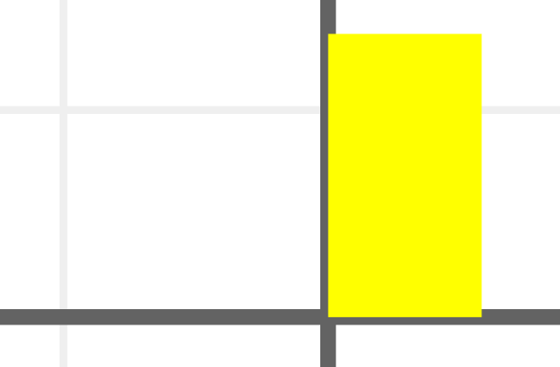
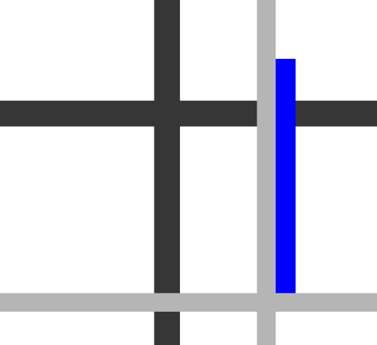
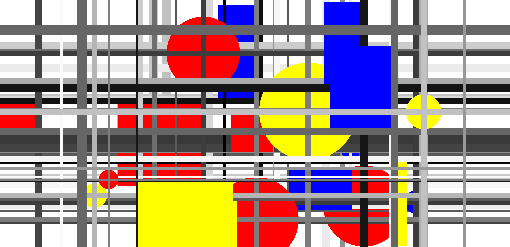

# HW04B Notes

This assignment is to create an interactive drawing interface. The shapes I chose are lines, rectangles, and circles. The interactivity is triggered by mouse clicks. 

## Inspiration
I got inspiration from Piet Mondriaan, who is famous for his grid-based paintings containing black lines and red, blue, yellow, and black color blocks. 
<table>
  <tr>
    <td>
      
    </td>
    <td>
      
    </td>
  </tr>
</table>

I would like to create an interactive drawing interface that mainly contains lines and rectangles. I didn't seek to remake Piet Mondriaan's artwork but to follow the abstract aesthetics. 

## Plan

I planned to create a shape set upon every click. There are three possible shape sets for drawing upon a click: 
- Two lines intersecting perpendicularly at the clicking location.
- Two lines intersecting perpendicularly + one rectangle at the clicking location.
- Two lines intersecting perpendicularly + one circle at the clicking location, but the circle will begin to fall off the screen once created. 

I also decided to randomize the color of these shapes. Each rectangle and circle generated will have a fill color of `'red'`, `'blue'`, or `'yellow'`. The three fill colors have an equal possibility of appearing. For the two lines generated upon every click, they will have the same stroke color: `stroke(random(0,255))`. 

Another randomized property is the size of the shape. The size of a rectangle, the diameter of a circle, and the stroke weight of a line set are all randomly selected in certain ranges of numbers. 

One thing interesting about the rectangles is their orientations. Since the two lines separate the canvas into four quadrants, the rectangles can lie in any of them. 

## Execution
### Randomization of colors and shapes
The randomization of lines is easy: I directly used `random()` to randomize their stroke weight between 30 and 300, and their color code between 0 and 255.  
To realize the randomization of colors and shapes, I used the switch statement. The switch statement takes in an integer index and looks up the case corresponding to this index in its case list, then executes the code lines in that case. 

### Generate random integers
My program requires random integer generation due to the use of switch statements. Since I didn't find a random integer function in p5.js or JavaScript, I wrote a function named `randomInt(max)`, which will receive an integer and generate an integer smaller than the received one. 

### Draw rectangle
As planned, a rectangle can be drawn in any of the four quadrants divided out by the two lines. The easiest way I thought of is to first translate the canvas to the clicking position, then rotate it by 0, PI/2, PI, or 3*PI/2 radians. Upon finishing the rectangle drawing, the canvas is rotated and translated back to the original position so that the upcoming drawings won't mess up. 

### When to draw the lines? 
Initially, I let the code draw lines before a rectangle. However, since the lines have a stroke weight, the following rectangle would weirdly cover part of the two lines, making viewers think that the two lines are two very thin rectangles. To avoid this visual misunderstanding, I changed the sequence to drawing a rectangle first, then the two lines. 
<table>
  <tr>
    <td>
      
    </td>
    <td>
      
    </td>
  </tr>
</table>

### Where to put the circle code?
My initial drawing without circle animation looks like below: 

Then the next step is to animate the circle. However, it didn't seem right to put the circle code in either `mouseClicked()` or `draw()`. If put the circle drawing code in `mouseClicked()`, the circle will not animate. If put in `draw()` to draw a circle when the shape index is 1 (the shape index I assigned to a circle), there won't be an animated falling circle but a series of circles drawn all the way down from the clicking position. This is because the shape index is not updated until the next click; if the global variable `shapeIndex` is always 1, then the `draw()` function will continuously draw circles. 

Upon searching online, I learned that it is way more complicated to animate only the circle while leaving everything else static on canvas: I need at least several arrays to store all the shapes I have drawn. Therefore, I changed my plan. I added a `background(255)` code in the if statement in `draw()`. While the code doesn't function exactly as I had planned, it now functions in another interesting way: the animated circle is like an 'eraser' to the canvas. Every time the mouse is clicked, one of the three shape sets will be drawn: only lines, lines + a rectangle, and a circle. If it happens to be a circle, all the previous drawings will be erased, and a circle will animate downward from the clicking position. 
